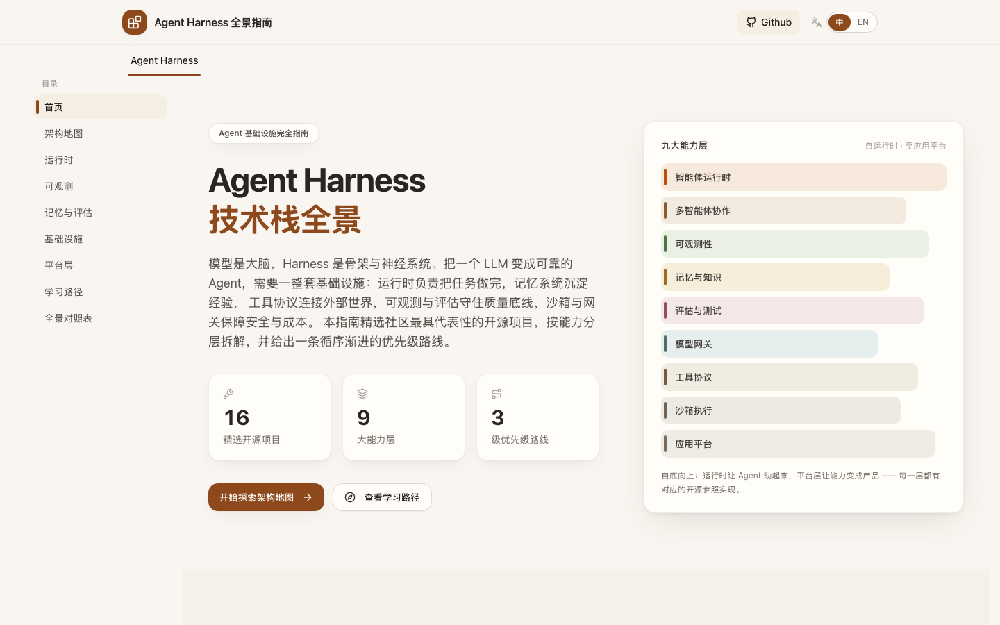
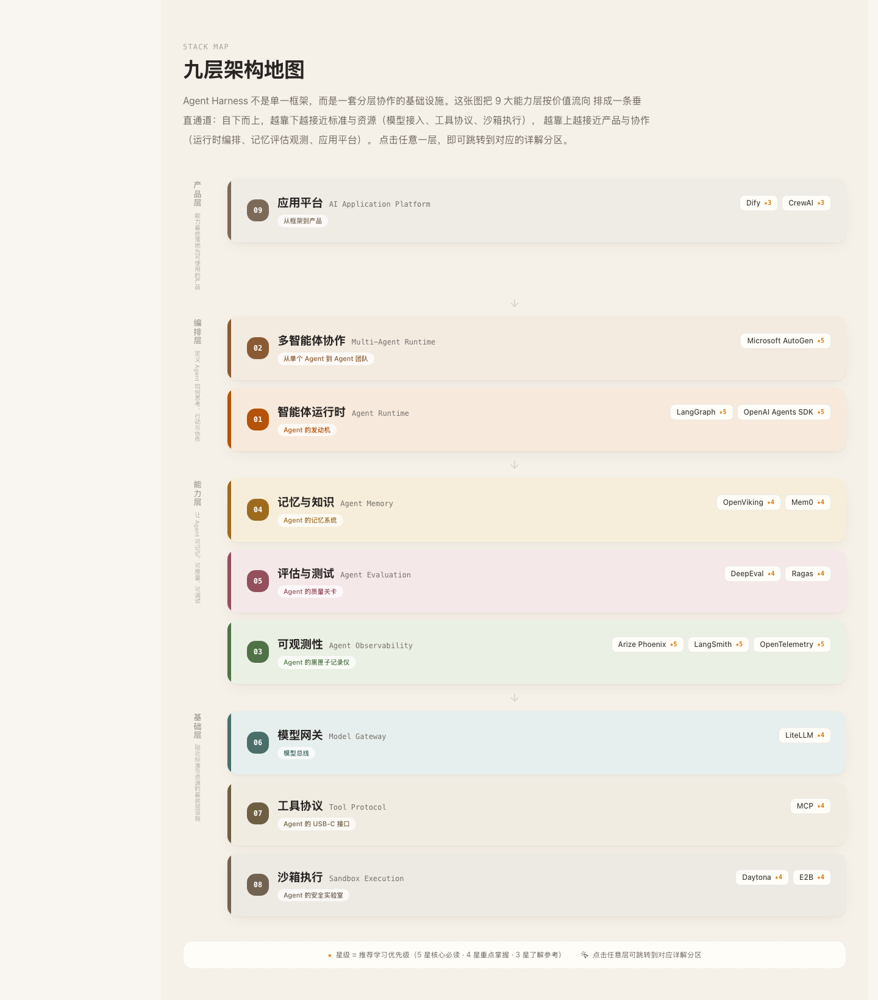
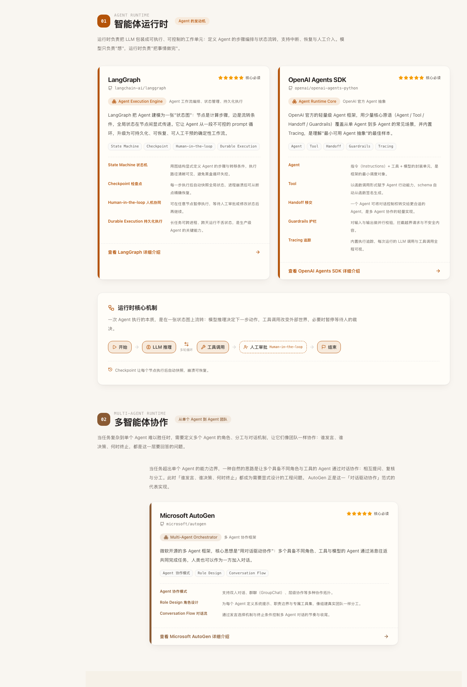
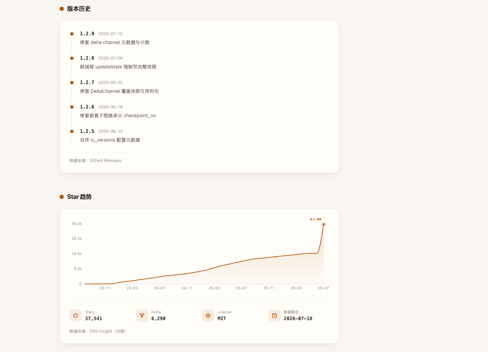
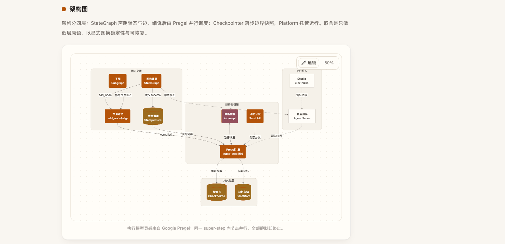
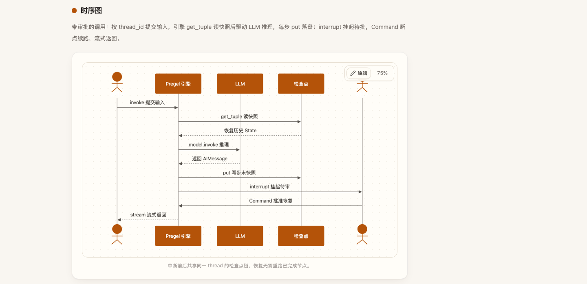

[中文](README.md) · English

# Agent Harness Stack Guide

An interactive learning site: a layered map plus 16 open-source projects that explain what an **Agent Harness** is in modern Agent systems.

**Live site:** https://aialtas.site/

---

## What is Agent Harness

The model is the brain; an **Agent Harness** is the skeleton and nervous system that turn an LLM into a reliable Agent.

One framework is rarely enough. Production systems also need orchestration and state, multi-agent collaboration, tracing / evaluation / monitoring, memory and knowledge, model gateways, tool protocols, sandboxed execution, and shippable application platforms. “Harness” means this **layered infrastructure stack**, not a single product name.

This site splits those capabilities into nine layers and deep-dives representative open-source projects so you can form a reading order and selection map.

---

## How to use the site

1. Open the [live site](https://aialtas.site/) and start from the **stack map** (`#map`).  
2. Browse by section: runtime → observability → memory & eval → infrastructure → platform.  
3. Open the **learning path** (`#path`), pick projects by ★ priority, then open a detail page.  
4. Detail pages (`/tool/:id`) show star trends, versions, four diagram types, and design notes.  
5. Switch Chinese / English from the top bar.

| Path | Content |
| --- | --- |
| `/` | Map, layers, learning path, comparison table |
| `/tool/:id` | Project deep-dive, e.g. `/tool/langgraph` |

Anchors: `#map` · `#runtime` · `#observability` · `#memory` · `#infra` · `#platform` · `#path` · `#table`

---

## Learning path

Don’t start by “picking one framework.” Read by priority:

| Priority | Meaning | Start with |
| --- | --- | --- |
| ★★★★★ Must-read | Harness skeleton | LangGraph, OpenAI Agents, AutoGen, Phoenix, LangSmith, OpenTelemetry |
| ★★★★☆ Core | Common in production | OpenViking, Mem0, DeepEval, Ragas, LiteLLM, MCP, Daytona, E2B |
| ★★★☆☆ Reference | Product shapes | Dify, CrewAI |

Nine layers:

1. **Agent Runtime** — orchestration, state, resume  
2. **Multi-Agent** — roles, dialogue, stop conditions  
3. **Observability** — traces, eval, production monitoring  
4. **Memory & knowledge** — cross-session recall  
5. **Evaluation** — regression and quality gates  
6. **Model gateway** — multi-provider calls and cost  
7. **Tool protocol** — discovery and permissions (MCP)  
8. **Sandbox** — safe execution of generated code  
9. **Application platform** — shippable workflows and ops  

---

## Screenshots













---

## The 16 projects

| Project | id | Layer | Priority | One-liner | GitHub |
| --- | --- | --- | --- | --- | --- |
| LangGraph | `langgraph` | Runtime | ★★★★★ | Workflow orchestration & durable execution | [langchain-ai/langgraph](https://github.com/langchain-ai/langgraph) |
| OpenAI Agents SDK | `openai-agents` | Runtime | ★★★★★ | Lightweight Agent abstraction | [openai/openai-agents-python](https://github.com/openai/openai-agents-python) |
| AutoGen | `autogen` | Multi-agent | ★★★★★ | Conversation-driven multi-Agent | [microsoft/autogen](https://github.com/microsoft/autogen) |
| Phoenix | `phoenix` | Observability | ★★★★★ | OTel-native trace / eval | [Arize-ai/phoenix](https://github.com/Arize-ai/phoenix) |
| LangSmith | `langsmith` | Observability | ★★★★★ | Ops & monitoring by LangChain | [langchain-ai/langsmith-sdk](https://github.com/langchain-ai/langsmith-sdk) |
| OpenTelemetry | `opentelemetry` | Observability | ★★★★★ | Vendor-neutral telemetry standard | [open-telemetry/opentelemetry-specification](https://github.com/open-telemetry/opentelemetry-specification) |
| OpenViking | `openviking` | Memory | ★★★★☆ | Agent context & knowledge | [volcengine/OpenViking](https://github.com/volcengine/OpenViking) |
| Mem0 | `mem0` | Memory | ★★★★☆ | Long-term memory layer | [mem0ai/mem0](https://github.com/mem0ai/mem0) |
| DeepEval | `deepeval` | Evaluation | ★★★★☆ | pytest-style LLM eval | [confident-ai/deepeval](https://github.com/confident-ai/deepeval) |
| Ragas | `ragas` | Evaluation | ★★★★☆ | RAG pipeline evaluation | [explodinggradients/ragas](https://github.com/explodinggradients/ragas) |
| LiteLLM | `litellm` | Gateway | ★★★★☆ | Multi-provider model gateway | [BerriAI/litellm](https://github.com/BerriAI/litellm) |
| MCP | `mcp` | Protocol | ★★★★☆ | Tools & data access protocol | [modelcontextprotocol/servers](https://github.com/modelcontextprotocol/servers) |
| Daytona | `daytona` | Sandbox | ★★★★☆ | Secure Agent execution | [daytonaio/daytona](https://github.com/daytonaio/daytona) |
| E2B | `e2b` | Sandbox | ★★★★☆ | Firecracker cloud sandboxes | [e2b-dev/E2B](https://github.com/e2b-dev/E2B) |
| Dify | `dify` | Platform | ★★★☆☆ | Open-source LLM app platform | [langgenius/dify](https://github.com/langgenius/dify) |
| CrewAI | `crewai` | Platform | ★★★☆☆ | Role-playing multi-Agent | [crewAIInc/crewAI](https://github.com/crewAIInc/crewAI) |

---

## Run locally

Node.js ≥ 20.

```bash
git clone https://github.com/MarkingYang/k3-agent-harness-atlas.git
cd k3-agent-harness-atlas
npm install
npm run dev
```

Open http://localhost:7200

| Command | Purpose |
| --- | --- |
| `npm run dev` | Dev server (port 7200) |
| `npm run restart` | Clear port conflict and restart |
| `npm run build` / `npm run preview` | Build and preview |
| `npm run lint` | ESLint |

---

## Data notes

- Stars / versions checked via GitHub API on **2026-07-18**; copy from official docs.  
- Star curves are OSS Insight samples and may differ slightly.  
- For learning only; treat official repos as source of truth.

See [CONTRIBUTING.md](CONTRIBUTING.md). License: [MIT](LICENSE).

Thanks to the open-source projects and communities above.
